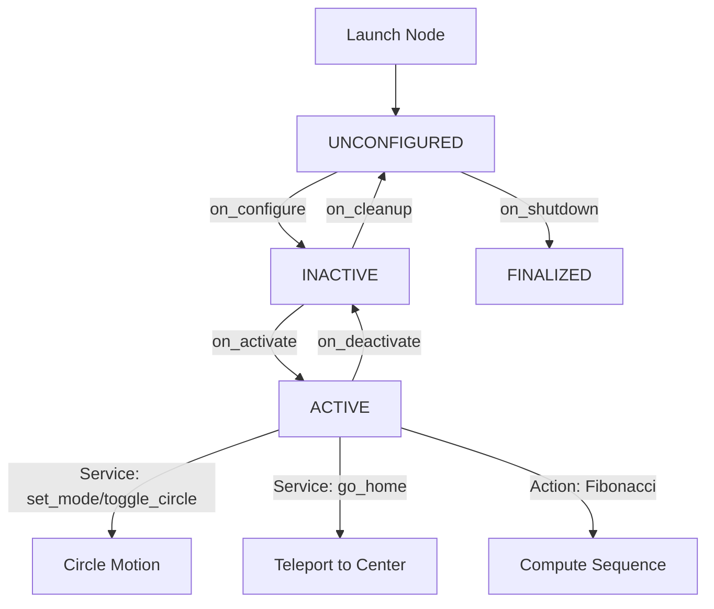

# steerai_demo_lifecycle_controller

A **ROS 2 LifecycleNode–based demo controller** for `turtlesim` that demonstrates:

- ✅ **Full LifecycleNode support** (`configure`, `activate`, `deactivate`, `cleanup`, `shutdown`)
- ✅ **Internal operational state machine** (modes: `IDLE`, `CIRCLE`, `ERROR`)
- ✅ **Separation of concerns** — Core algorithm logic is ROS-agnostic and unit-tested
- ✅ **Dynamic parameters** with validation and descriptor metadata
- ✅ **All major ROS 2 communication patterns**:
  - Lifecycle Publisher (`/turtle1/cmd_vel`)
  - Subscriber (`/turtle1/pose`)
  - Services (`/set_mode`, `/toggle_circle`, `/go_home`, `/health`)
  - Client (`/turtle1/teleport_absolute`)
  - Action Server (`/demo_action` implementing `example_interfaces/action/Fibonacci`)
  - Timers

---

## Docker Container Build and Usage
Build the image using Dockerfile from the `steerai_demo_lifecycle_controller` folder

```bash
cd <steerai_demo_lifecycle_controller folder path>
DOCKER_BUILDKIT=1 docker build -t steerai/lifecycle:humble .
```
Run the Container after successful image build

```bash
docker run --rm -it --name steerai_demo --env="DISPLAY=$DISPLAY" --env="QT_X11_NO_MITSHM=1" --volume="/tmp/.X11-unix:/tmp/.X11-unix:rw" --env="XAUTHORITY=$XAUTH" --volume="$XAUTH:$XAUTH" --net=host steerai/lifecycle:humble
```

Once inside the container, run below command to lunch the node and leave this node running in terminal

```bash
source install/local_setup.bash
ros2 launch steerai_demo_lifecycle_controller demo.launch.py
```

Open another terminal:
```bash
docker exec -it turtle_lifecycle_dev bash
```
Once inside the container, run below command to source the workspace
```bash
source install/setup.bash 
source install/local_setup.bash 
```
Now you can run below commands and play with the turtle:

```bash
# Configure and activate lifecycle node
ros2 lifecycle set /turtle_lifecycle_controller configure
ros2 lifecycle set /turtle_lifecycle_controller activate

# Switch to CIRCLE mode
ros2 service call /set_mode std_srvs/srv/SetBool "{data: true}"

# Enable circle motion and You should now see the turtle moving in circles.
ros2 service call /toggle_circle std_srvs/srv/SetBool "{data: true}"

# While the turtle is moving. You’ll see feedback streaming and a succeeded result while the turtle keeps circling.
ros2 action send_goal /demo_action example_interfaces/action/Fibonacci "{order: 10}"
```

## 🛠 Adjust Parameters Dynamically 
The linear speed and angular speed can be changed through launch file as well before launch. Additionally, these can be altered using below commands during runtime. 

```bash
ros2 param set /turtle_lifecycle_controller linear_speed 0.8
ros2 param set /turtle_lifecycle_controller angular_speed 1.5
```

## System Architecture and Process Flow

### 1) System Context
```mermaid
flowchart LR
  User([Operator])
  subgraph Host[Host OS]
    X11[X Server / XWayland]
    Docker[(Docker Engine)]
  end

  subgraph Container[Docker Container : ROS Humble]
    Turtlesim[turtlesim_node]
    Ctrl[TurtleLifecycleController (LifecycleNode)]
    ROS2[ROS 2 Middleware (DDS)]
  end

  User -- GUI --> X11
  X11 <-. DISPLAY .-> Turtlesim
  User --> Ctrl
  Ctrl <--> ROS2
  Turtlesim <--> ROS2
  Docker <-- bind mounts & net=host --> Container
```

### 2) Node Process Flow
