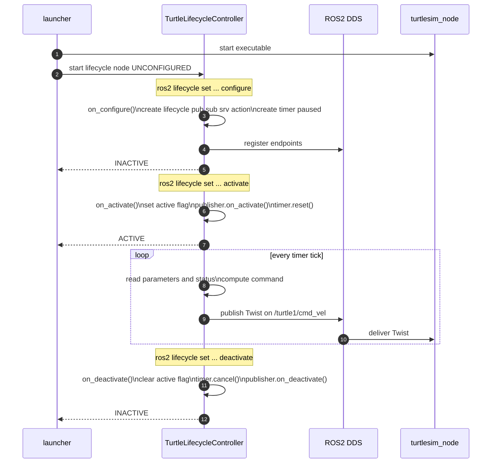
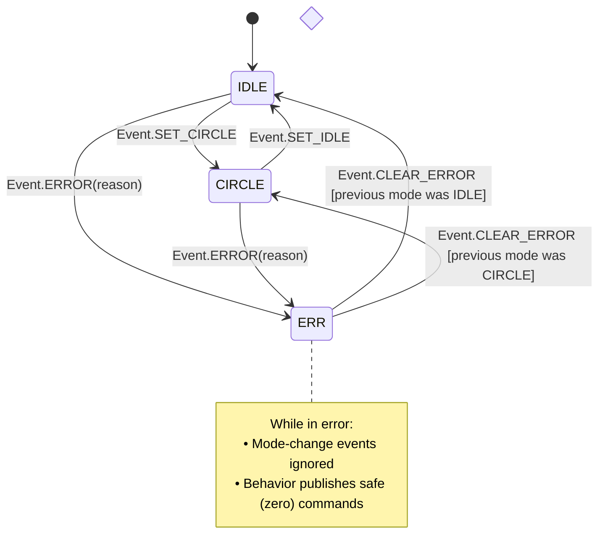
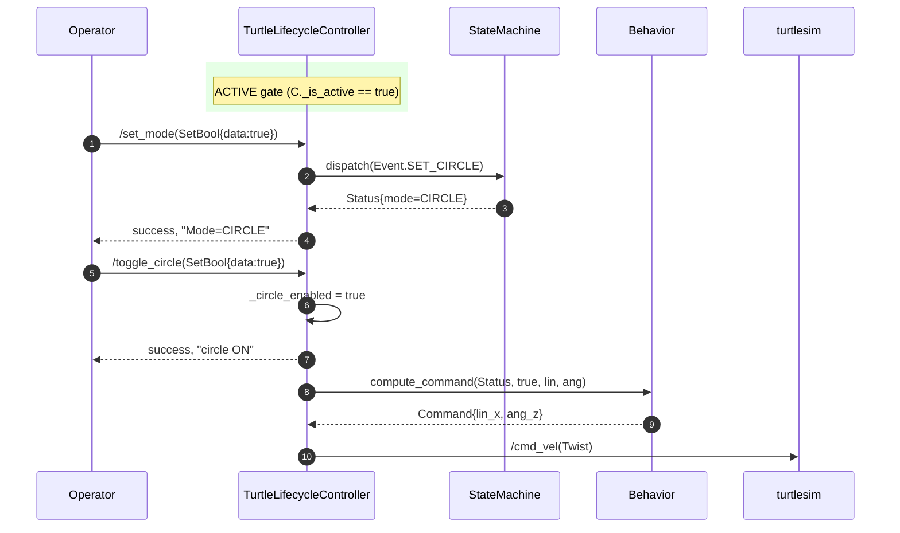

# steerai_demo_lifecycle_controller

A **ROS 2 LifecycleNode–based demo controller** for `turtlesim` that demonstrates:

- ✅ **Full LifecycleNode support** (`configure`, `activate`, `deactivate`, `cleanup`, `shutdown`)
- ✅ **Internal operational state machine** (modes: `IDLE`, `CIRCLE`, `ERROR`)
- ✅ **Separation of concerns** — Core algorithm logic is ROS-agnostic and unit-tested
- ✅ **Dynamic parameters** with validation and descriptor metadata
- ✅ **All major ROS 2 communication patterns**:
  - Lifecycle Publisher (`/turtle1/cmd_vel`)
  - Subscriber (`/turtle1/pose`)
  - Services (`/set_mode`, `/toggle_circle`, `/go_home`, `/health`)
  - Client (`/turtle1/teleport_absolute`)
  - Action Server (`/demo_action` implementing `example_interfaces/action/Fibonacci`)
  - Timers

---

## System Architecture and Process Flow

#### 1) Class Diagram (Core + Adapter) 

#### 2) Lifecycle Sequence (Configure → Activate → Run → Deactivate)

#### 3) Operational Mode & Events (Internal State Machine)

#### 4) Service / Action Interactions (when ACTIVE)
