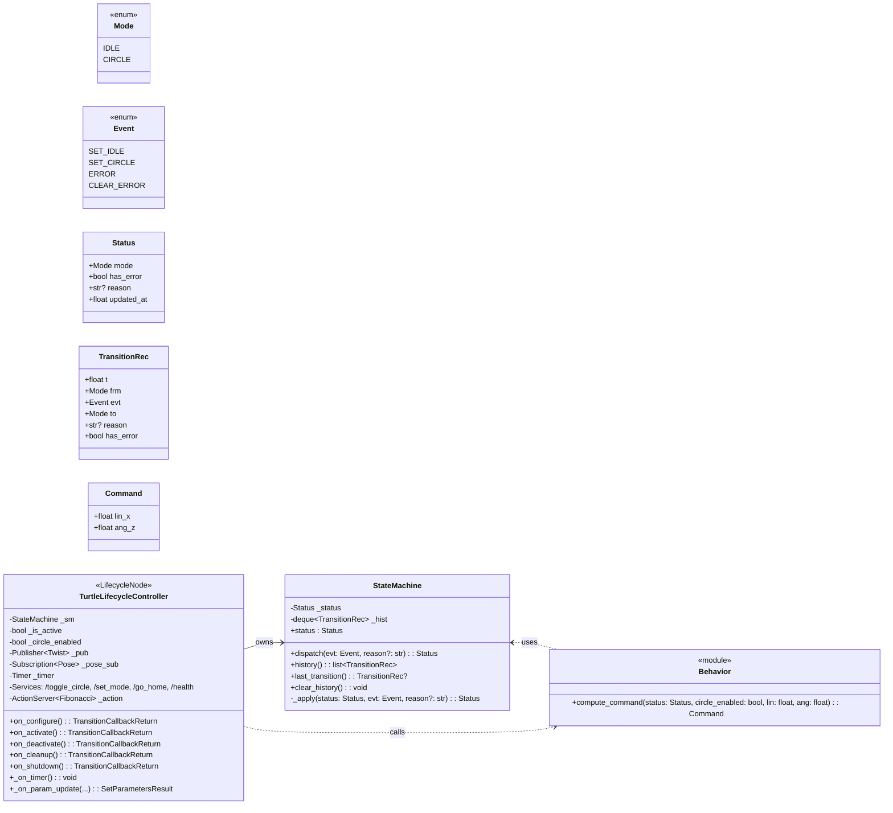
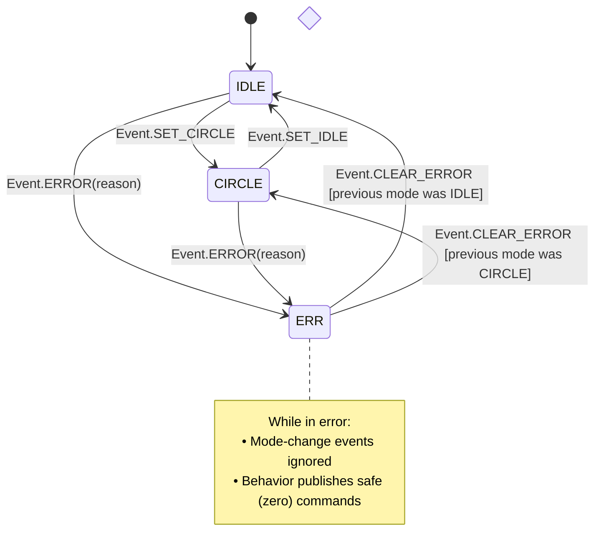
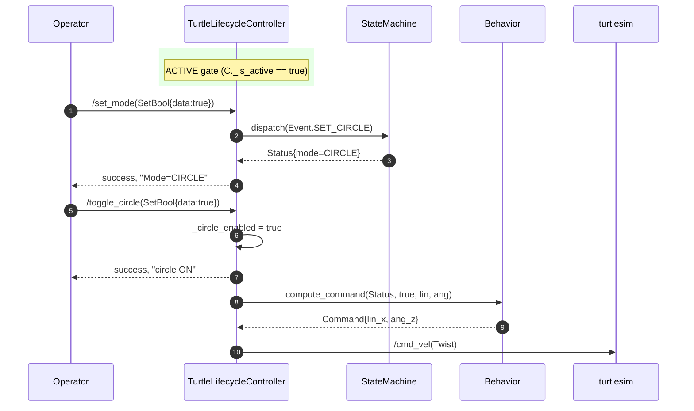

# steerai_demo_lifecycle_controller

A **ROS 2 LifecycleNode–based demo controller** for `turtlesim` that demonstrates:

- ✅ **Full LifecycleNode support** (`configure`, `activate`, `deactivate`, `cleanup`, `shutdown`)
- ✅ **Internal operational state machine** (modes: `IDLE`, `CIRCLE`, `ERROR`)
- ✅ **Separation of concerns** — Core algorithm logic is ROS-agnostic and unit-tested
- ✅ **Dynamic parameters** with validation and descriptor metadata
- ✅ **All major ROS 2 communication patterns**:
  - Lifecycle Publisher (`/turtle1/cmd_vel`)
  - Subscriber (`/turtle1/pose`)
  - Services (`/set_mode`, `/toggle_circle`, `/go_home`, `/health`)
  - Client (`/turtle1/teleport_absolute`)
  - Action Server (`/demo_action` implementing `example_interfaces/action/Fibonacci`)
  - Timers

---

## System Architecture and Process Flow

#### 1) Component / Package Structure
```mermaid
flowchart TB
  subgraph Pkg[steerai_demo_lifecycle_controller (ament_python)]
    subgraph Core[core (ROS-agnostic)]
      SM[state_machine.py\nMode/Event/Status + history]
      BHV[behavior.py\ncompute_command()]
    end

    Node[node.py\nLifecycleNode adapter]
    Launch[launch/demo.launch.py]
    Tests[tests/\nunit + launch_testing]
  end

  Turtlesim[[turtlesim_node]]
  ROSDDS[(ROS 2 DDS)]
  X11[X Server]

  Node -- pub/sub/srv/action/timer --> ROSDDS
  Turtlesim -- /pose ↔ /cmd_vel --> ROSDDS
  Node -- converts --> Core
  Turtlesim -. GUI .-> X11
```

#### 2) Class Diagram (Core + Adapter) 


#### 3) Lifecycle Sequence (Configure → Activate → Run → Deactivate)
```mermaid
sequenceDiagram
  autonumber
  participant L as launch/demo.launch.py
  participant C as TurtleLifecycleController
  participant DDS as ROS 2 DDS
  participant T as turtlesim_node

  L->>T: start executable
  L->>C: start LifecycleNode (UNCONFIGURED)

  Note over C: ros2 lifecycle set ... configure
  C->>C: on_configure()<br/>create lifecycle publisher, sub, services, action, timer (paused)
  C->>DDS: register pub/sub/services/action
  C-->>L: INACTIVE

  Note over C: ros2 lifecycle set ... activate
  C->>C: on_activate()<br/>_is_active = True, publisher.on_activate(), timer.reset()
  C-->>L: ACTIVE

  loop Every timer tick
    C->>C: read parameters (lin, ang); status := _sm.status
    C->>C: cmd = compute_command(status, _circle_enabled, lin, ang)
    C->>DDS: publish Twist(/turtle1/cmd_vel)
    DDS->>T: deliver Twist
  end

  Note over C: ros2 lifecycle set ... deactivate
  C->>C: on_deactivate()<br/>_is_active=False, timer.cancel(), publisher.on_deactivate()
  C-->>L: INACTIVE
```

#### 4) Operational Mode & Events (Internal State Machine)


#### 5) Service / Action Interactions (when ACTIVE)
